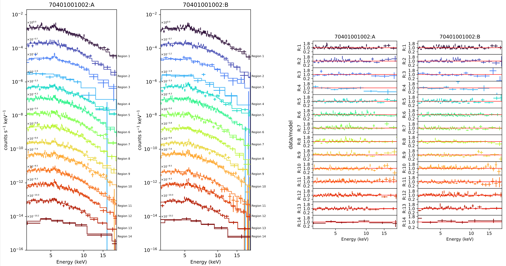

# NuCrossARF Plotting

This Jupyter Notebook (or scripts version) will walk you through how to replot the output (spectra and fits) of the NuCrossARF routines (https://github.com/danielrwik/nucrossarf) to seperate out individual regions and look at the individual fits.

There is a script version in 'Script_Version' if you prefer running scripts instead of a Jupyter Notebook.

There is also a new set of scripts in 'Plot_All_Model_Contributions', which will plot each model contribution for a single region.

You'll go from this:

to this:

